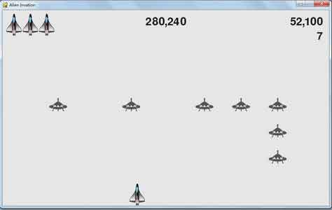
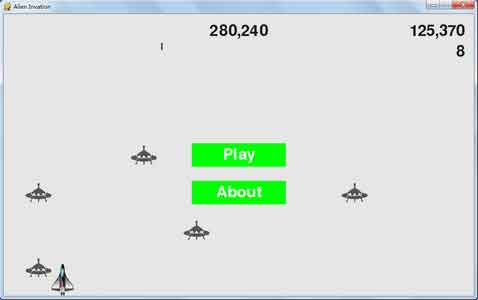
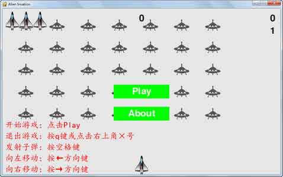

Within the interface before you start, there are only two buttons (*Play* and *About*) in total--one for starting your game and the other for learning operating instructions.

Here are some basic instructions: the space bar for firing, left or right arrow keys for moving left or right and the q key for exit.

Highest score will be saved to a local file, and each time you start playing or retry, the game will check whether the score stored in the file is higher than your current score and eventually show the higher one.

Sound effects are also available, i.e., when the bullet you fired hit an alien or an alien collide with the aircraft in the game, it'll make some sound.

Several screenshots:

*Overview:*

*How you died:*

*Instructions:*

